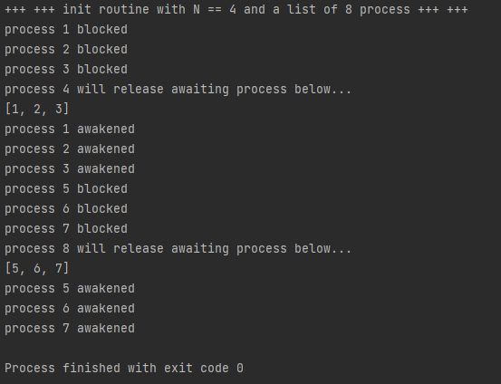

# Semaphore

Cette petite application a pour rôle de mieux comprendre le pseudo code d'un devoir maison du CNAM.

Il suffit d'exécuter `main.py` pour lancer conçu pour python 3.

Après avoir initialisé les variables (avec N=4), sémaphores, ainsi qu'un tableau de 8 processus,
on lance l'algorithme pour chaque processus. Voici la sortie console du programme :

#### Output

#### Analyse : 
On remarque que les processus multiples de N sont 'masqués' : ils ne sont ni endormis ni réveillés. Tout se
passe comme ci chaque processus invoquant l'algorithme était systématiquement endormi (bloqué) puis 
lorsqu'un processus de rang N parcours l'algorithme, celui ci reste élu, mais reveille tous ceux qui sont 
bloqués.

#### Conclusion :
L'algorithme proposé semble être un dispositif pour retarder l'exécution des processus. Ceux ci ne sont 
basculés dans la file `prêt` de l'ordonnanceur que lorsque le N-ième processus (ou multiple de N) intervient.